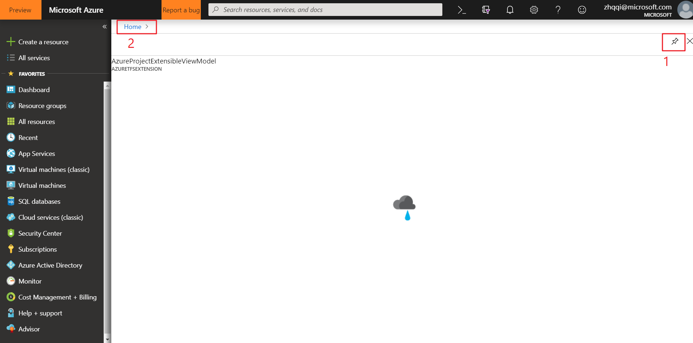
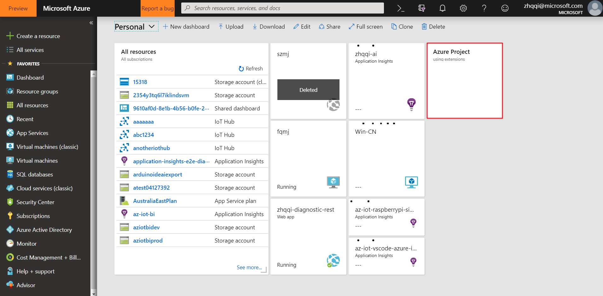
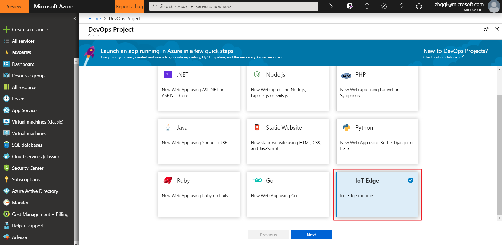
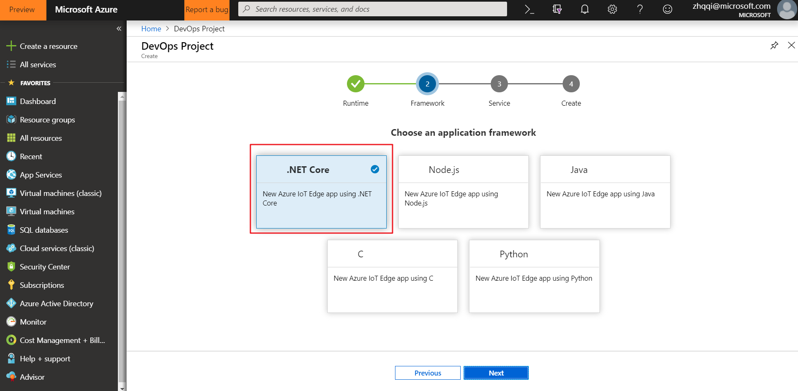
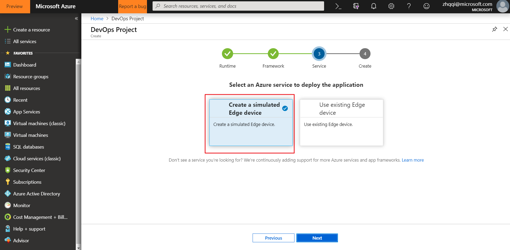

# DevOps for IoT Edge

## Setup

### 1. Install the VSTS extensions
Since the extensions are still in private state, you need to contact `zhqqi@microsoft.com` to share the following two extensions.
* Azure IoT Edge for VSTS(preview)
* DevOps for IoT Edge

Go to [https://YOUR-ACCOUNT-NAME.visualstudio.com/_admin/_extensions](https://YOUR-ACCOUNT-NAME.visualstudio.com/_admin/_extensions) (Replace `YOUR-ACCOUNT-NAME` with your VSTS account name) and install the extensions listed in `Shared with this organization`.

### 2. Open Azure portal preview
Open this link [https://ms.portal.azure.com/?AzureTfsExtension_clientOptimizations=false&AzureTfsExtension_extensionAccountName=YOUR-ACCOUNT-NAME#blade/AzureTfsExtension/AzureProjectExtensibleViewModel](https://ms.portal.azure.com/?AzureTfsExtension_clientOptimizations=false&AzureTfsExtension_extensionAccountName=YOUR-ACCOUNT-NAME#blade/AzureTfsExtension/AzureProjectExtensibleViewModel). Replace `YOUR-ACCOUNT-NAME` with your VSTS account name.  
If you see the load failure page. Click the `pin` icon on the top-right, and then goto the homepage of dashboard.  

Then click the `Azure Project using extensions`.

### 3. Configure DevOps project

Choose runtime `IoT Edge`.

Choose framework `Edge .NET`.

Choose service `Create a simulated Edge device`.

Fill in necessary configuration.

### 4. Deployment

After deployment succeeds, you can check with:
* VSTS project that contains codes and CI/CD pipeline.[https://YOUR-ACCOUNT-NAME.visualstudio.com/YOUR-PROJECT-NAME](https://YOUR-ACCOUNT-NAME.visualstudio.com/YOUR-PROJECT-NAME)
* Resource type `DevOps project` in Azure resource group which contains a dashboard to view the status of resources(current not available).